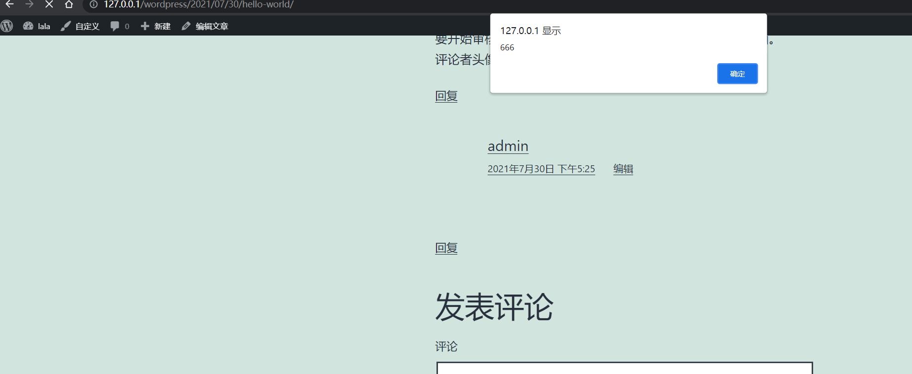

# donate-with-qrcode<=1.4.1 Authenticated Stored Cross-Site Scripting(XSS)

## Description

    The plugin doesn't properly sanitise qrcode links, which result into a Stored Cross-Site Scripting(XSS).

## Affects Plugins

    donate-with-qrcode<=1.4.1
    https://wordpress.org/plugins/donate-with-qrcode/

## Author

    yangshengcheng@webray.com.cn inc

## Proof of Concept

Open wechat switch and edit the "qrcode links " text area to 
```
'; alert(666);var var1='
```


Visit the posts page. We can see the alert page.




